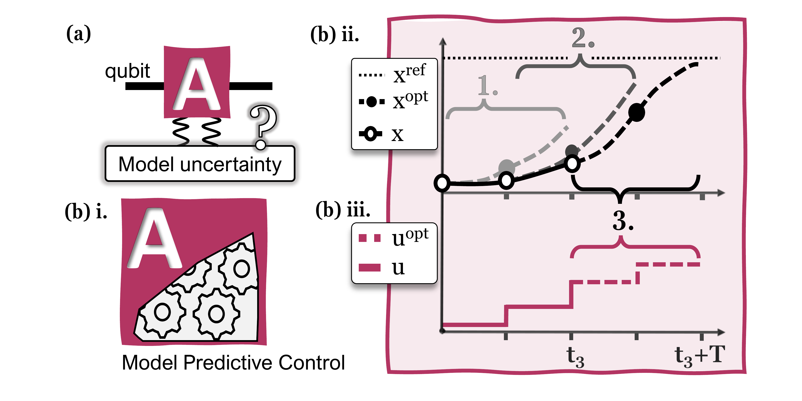

|LIC|

MPC for robust quantum state preparation
^^^^^^^^^^^^^^^^^^^^^^^^^^^^^^^^^^^^^^^^

**MPC4quantum** is the Python code accompanying the paper: `Model predictive control for robust quantum state preparation <https://arxiv.org/abs/2201.05266>`_ by myself, J. DuBois, S. Brunton and N. Kutz. 

MPC is a widely-used control strategy that plans its decisions according to a receding horizon: a new plan is drawn up at every arrival of new measurement feedback. Notably, MPC possess a number of structural advantages for closed-loop control of systems with imperfectly known dynamics. This makes MPC a relevant approach for the control of superconducting qubit systems where model discrepancies often inhibit pulse-optimal control design. We demonstrate the advantages of our MPC framework using simulations of robust quantum state preparation for ideal qubits, weakly-anharmonic qubits, and qubits coupled by undesired crosstalk.

Example
-------

    *In the circuit model a qubit is represented by a line segment, and a box is draw to indicate a quantum process applied to the qubit. Here, we represent a quantum state preparation abstractly by A and posit uncharacterized modifications that make A's model unreliable for open-loop control. (b) Under the hood of the A operation, robust control pulses are designed using model predictive control (MPC). In (b) ii-iii, MPC synthesizes a robust control input by incorporating state feedback into a sequence of receding-horizon control laws (in (b) ii, the first three MPC iterations are labeled 1., 2., 3., and colored with increasing grayscale value). At each MPC iteration, an open-loop control is solved over the current prediction horizon T using A's unreliable system model to yield optimal x and u trajectories over the horizon. The first entry of the open-loop solution is applied as u(t), and the resulting state x(t+1) is recorded in (b) ii. The next MPC iteration begins from this recorded state.*
    
Usage
-----

A good starting point is to consult the test cases provided in::
   
   tests/test_mpc4quantum.py

and many of the examples in the paper are modificaitons of the provided tests.

.. |LIC| image:: https://img.shields.io/badge/License-MIT-blue.svg
   :target: https://derivative.readthedocs.io/en/latest/license.html
   :alt: MIT License
